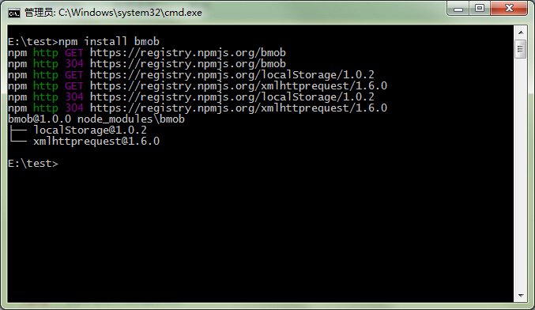
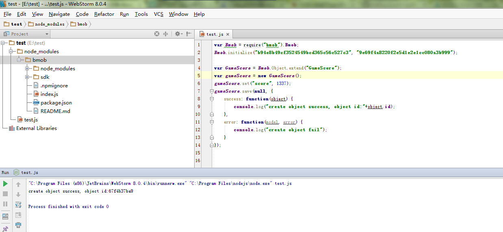

Bmob Nodejs模块
==================

## 安装Bmob NodeJs模块

在你的NodeJs工程中执行如下语句：

```
npm install bmob
```

如下图所示：



## 调用Bmob NodeJs模块

下面以添加一行数据为例，说明如何使用Bmob NodeJs模块。

```
//调用Bmob模块
var Bmob = require("bmob").Bmob;
//初始化，第一个参数是Application_id，第二个参数是REST API Key
Bmob.initialize("b94e8b49cf3524549bcd365c56c527c3", "9e69f4a8220f2e5d1e2e1cc080a3b999");

//添加一行数据
var GameScore = Bmob.Object.extend("GameScore");
var gameScore = new GameScore();
gameScore.set("score", 1337);
gameScore.save(null, {
    success: function(object) {
        console.log("create object success, object id:"+object.id);
    },
    error: function(model, error) {
        console.log("create object fail");
    }
});
```

如下图所示：



更多的使用例子可直接参考Bmob Js开发文档：http://docs.bmob.cn/jssdk/developdoc/index.html?menukey=develop_doc&key=develop_jssdk

## Bmob官方信息

官方网址：[http://www.bmob.cn](http://www.bmob.cn)

问答社区：[http://wenda.bmob.cn](http://wenda.bmob.cn)

技术邮箱：support@bmob.cn

